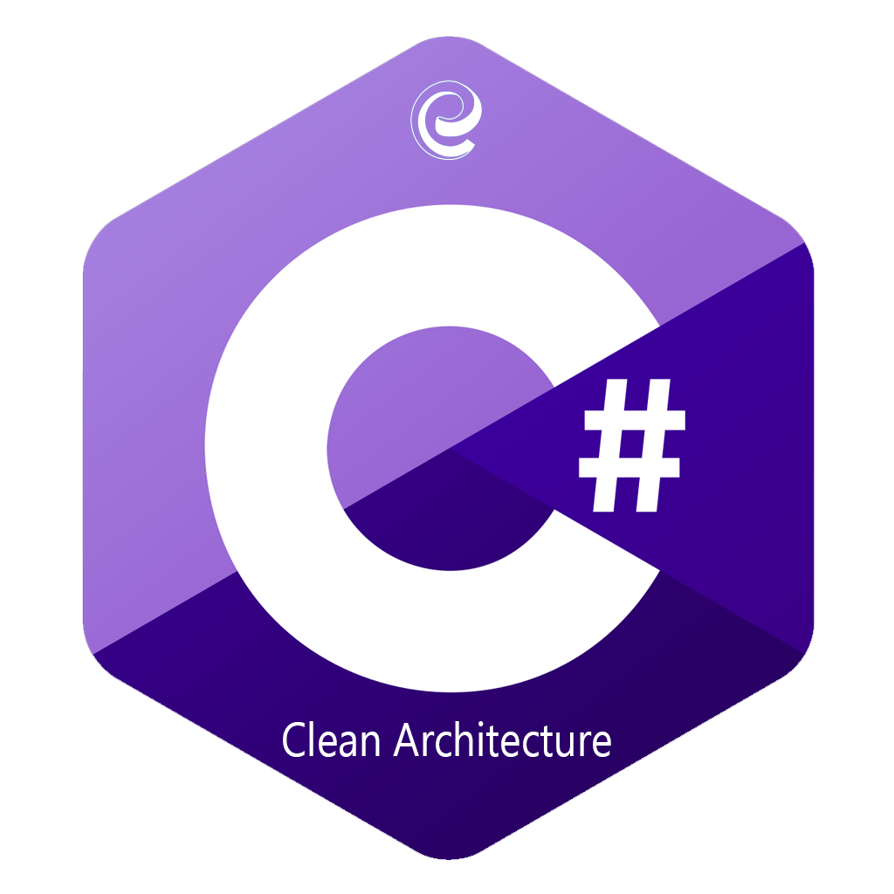

 
 
 # .NET Template
 
 

This is a solution template for creating a backend framework following the principles of Clean Architecture. It provides a layered structure that promotes separation of concerns and modularity, allowing for easier maintenance, scalability, and reusability. The template is designed to be used as a starting point for creating .NET applications and can be reused by different people.

## Technologies

The solution template incorporates the following technologies:

-   .NET 9
-   Entity Framework Core 9
-   MediatR
-   FeatureManagement
-   Rate limiting
-   FluentValidation
-   Polly
-   Scalar UI (for OpenAPI visualization at `/scalar`)
-   NSwag (for API client generation)
-   NUnit, FluentAssertions, Moq

## Getting Started

There are 3 different architectural pattern templates to choose from

1. Layered Architecture -  - 
    1. Clean Template - Commands and Queries include DbContext directly because DbContext is a UnitOfWork and DbSets are Repositories. _Recommended version_
    2. Template with DataAccess Layer to separate Database logic from your business logic.
2. Clean Architecture - 
3. Vertical Slice Architecture _New_ - 

To get started with the solution template, follow these steps:

-   [ ] Install the latest .NET 9 SDK
-   [ ] Create a folder for your solution and copy the clean code solution into it.
-   [ ] Rename the Solution File on the new solution folder for your project.

## **Overview**

Several key benefits to think of when you are choosing a pattern.

1. **Modularity and Separation of Concerns:** The system is divided into well-defined layers, allowing for modular development and clear separation of functionalities. This enhances code maintainability and facilitates easier troubleshooting and updates.

2. **Scalability:** As each layer serves a specific purpose, scaling the system becomes more manageable. It allows for the addition or modification of layers without affecting the entire structure, making it easier to adapt to changing project requirements.

3. **Reusability:** Components within each layer can be reused across different parts of the system or in other projects, reducing development time and effort. This promotes a more efficient and cost-effective development process.

4. **Interoperability:** Layers can communicate through standardized interfaces, promoting interoperability. This allows for the integration of new technologies or updates in specific layers without disrupting the entire system.

5. **Collaborative Development:** Different teams can work on specific layers simultaneously, fostering parallel development and collaboration. This accelerates the overall project timeline and facilitates specialization within the development team.

6. **Maintainability:** With a clear structure and modular design, debugging and maintenance become more straightforward. Changes or updates to one layer are less likely to impact others, simplifying the maintenance process over the system's lifecycle.

7. **Adaptability to Change:** Layered architecture is inherently adaptable to changes in technology or project requirements. The independence of layers enables easier upgrades or replacements, ensuring the system remains flexible and responsive to evolving needs.

## **Architecture Patterns Overview**

### **Layered Architecture**

Layered architecture organizes a system into distinct, modular layers, each responsible for specific functions, fostering separation of concerns. This design promotes scalability, maintainability, and reusability, making it an excellent choice for projects as it enhances agility and facilitates collaborative development, allowing teams to focus on individual layers without compromising the overall system integrity.

#### **Advantages of choosing Layered instead of Clean**

While clean architecture offers a more rigorous and structured approach, layered architecture may be a pragmatic choice when prioritizing simplicity, quick adoption, and flexibility in technology selection for specific project needs.

### **Clean Architecture**

Clean Architecture, pioneered by software architecture expert Robert C. Martin, is a design philosophy that prioritizes separation of concerns, maintainability, and testability. Enforcing a clear and hierarchical structure minimizes dependencies and allows for interchangeable components within distinct layers. Clean Architecture promotes long-term scalability, adaptability to changing requirements, and a robust foundation for building systems that are easy to understand, extend, and maintain.

#### **Advantages of choosing this Clean instead of Layered**

While Layered Architecture provides simplicity and ease of adoption, Clean Architecture is a compelling choice when prioritizing strict architectural boundaries, testability, and a high degree of independence between components, which can be especially valuable in large, complex, or evolving projects.

### **Vertical Slice Architecture**

Vertical Slice Architecture, often associated with Domain-Driven Design and microservices, advocates for building end-to-end slices of functionality across all layers of the application stack. Unlike traditional horizontal layering, this approach emphasizes delivering a full, working feature set through the entire technology stack. Vertical Slice Architecture fosters a holistic understanding of business features, encourages cross-functional collaboration, and accelerates iterative development by providing a complete user experience with each implemented slice. This methodology promotes rapid feedback loops, enabling teams to iterate quickly and deliver value incrementally.

#### **Advantages of choosing Vertical Slice**

1. **Holistic Understanding:** By building end-to-end slices of functionality, developers gain a comprehensive understanding of how their code impacts the entire application. This holistic perspective enhances their ability to make informed decisions and promotes a deeper appreciation for the user experience.

2. **Rapid Feedback Loops:** Vertical slices enable developers to deliver tangible, functional features quickly. This facilitates rapid feedback from stakeholders and end-users, allowing for early validation and adjustments. The iterative nature of development becomes more efficient, reducing the time between code implementation and user feedback.

3. **Cross-Functional Collaboration:** Vertical slices encourage collaboration across different functional roles, as developers, designers, and other stakeholders work together to deliver complete features. This collaborative approach fosters better communication, shared ownership of features, and a more integrated development process.

4. **Incremental Value Delivery:** Developers can deliver incremental value with each vertical slice, providing tangible benefits to end-users or stakeholders at the end of every iteration. This aligns well with agile principles and allows for a more continuous and visible stream of progress.

5. **Mitigation of Integration Challenges:** By implementing features across all layers of the application stack in each vertical slice, integration challenges are addressed early in the development process. This reduces the likelihood of encountering major integration issues later in the project, making the overall development process smoother.

6. **Flexible Technology Stacks:** Vertical Slice Architecture allows for flexibility in choosing technologies at the feature level. Developers can use the most suitable tools for each slice without being constrained by global technology choices. This adaptability is particularly beneficial in scenarios where different features have varied technical requirements.

7. **Enhanced Developer Satisfaction:** Developers often find satisfaction in seeing their work result in tangible, user-facing features. Vertical Slice Architecture aligns with this desire for visible impact, as developers can witness the immediate results of their efforts in the form of complete features.

8. **Reduced Time-to-Market:** The rapid delivery of functional slices and continuous user feedback contribute to shorter development cycles. This, in turn, reduces the time-to-market for the overall product, allowing organizations to respond more quickly to changing market demands.

While Vertical Slice Architecture may not be a one-size-fits-all solution, its advantages in terms of rapid feedback, collaboration, and incremental value delivery make it a compelling approach, especially in dynamic and agile development environments.

## **Additional Resources**

For more information about the Command and Query Responsibility Segregation (CQRS) pattern, refer to the [CQRS](https://docs.microsoft.com/en-us/azure/architecture/patterns/cqrs#:~:text=The%20Command%20and%20Query%20Responsibility,performance%2C%20scalability%2C%20and%20security.)

Feel free to customize the solution template according to your specific requirements and extend it with additional features or technologies as needed.
